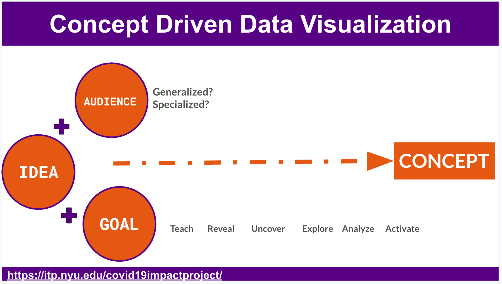
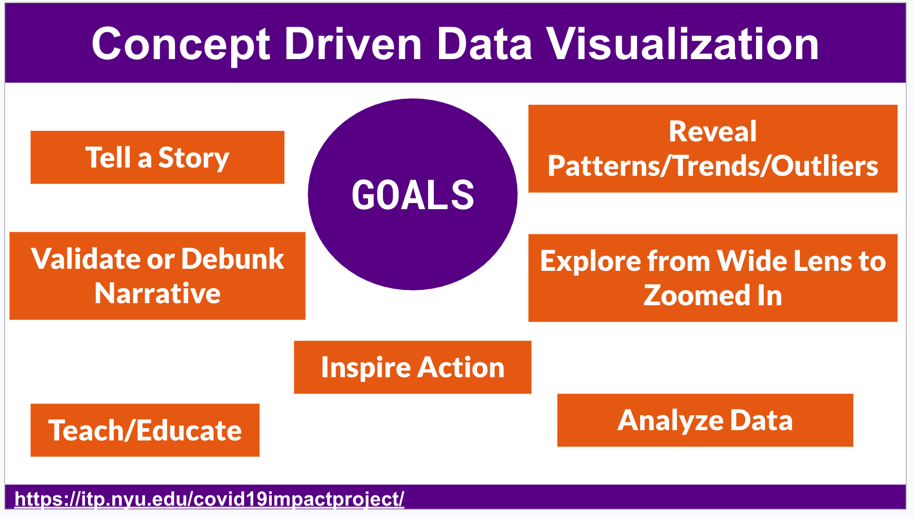

# Week 4

### CLASS GOALS:
#### Homework
- Review and discuss homework
- Podcast (Full Class)
- Missing Data

#### Final Project
- Concept Driven Data Storytelling
- Rubric and Ideation
- Discuss Next Week’s HW

#### Storytelling
- Beyond the numbers, beyond vizzies

#### Data Storytelling
- Big Data Stories 
- Personal Data Stories
- Data, Perception, Myth, Personal Narrative (TBD Week 5)

#### **Guest Speaker**
Cara Cai 

### CLASS ACTIVITIES:

1. **[Review homework](https://docs.google.com/presentation/d/1DEIWJVzJyCSeTFdtJaDw8tnUyHQRROa3NtmFLA9BhM8/edit#slide=id.g30f7365744f_0_0)**

**DISCUSS: The COVID Tracking Project**

- The importance of granularity to data integrity in the context of public health data.
- "Not just a data project... a project about human data"
- "Moral Injury... A systemic betrayal bythe organizations whose jobs it is to keep everyone safe"
- The myth of “The Great Equalizer”
- The importance of granularity, disaggregation and analysis
- Standardization in Data (Why is this important? What example was highlighted in the podcast?)
- What are the implications of the [COVID Racial Data Tracker](https://covidtracking.com/analysis-updates/state-of-COVID-race-and-ethnicity-data) and the [Long Term Care Tracker](https://covidtracking.com/analysis-updates/what-we-know-about-the-impact-of-the-pandemic-on-our-most-vulnerable-community) being retired?

2. **Round Robin: Share one thing in Episode 3 that**
- Surprised you…
- Inspired you…
- Left you with more questions
- Caused you to despair?

3. **Missing Data**

In pairs, respond to the following prompts:
- What did you glean from the Missing Data Project and the concept of “missing data”
- How did you come up with your ideas of data sets that may be missing?  Was it and easy process? Difficult?
 
**MISSING DATA: Collective action is a strategy for resistance**
- [GitHub Is Showing the Trump Administration Scrubbing Government Web Pages in Real Time](https://www.404media.co/github-is-showing-the-trump-administration-scrubbing-government-web-pages-in-real-time/)

- [Science Impact Map - A volunteer effort showing the role of NIH grants and the impact of funding cuts](https://scienceimpacts.org/?trk=feed-detail_main-feed-card-text)

- [Federal Funding Cuts and Impacts of Firing Workers: A colunteer croudsourcing project showing the impact and scale of firing of federal workers](https://theimpactproject.org/the-impact-map/)

### CLASS RESOURCES:
#### CONCEPT DRIVEN DATA VISUALIZATION

#### GOALS FOR CONCEPT DRIVEN DATA VISUALIZATION

#### STORYTELLING: Mirrors and Windows
- Stories are an important piece of the fabric that weaves together our collective humanity. 
- A story can provide a mirror or a window to someone else’s lived experience, engendering empathy and a sense of connection.
- Stories are also important stewards of our past and present experiences and can motivate us to envision a better future.

<!--
- **[The Making of the Johns Hopkins COVID Dashboard](https://www.jhuapl.edu/news/news-releases/210426-JHU-COVID-dashboard-oral-history)**
- **[Tableau Public](https://public.tableau.com/app/discover)** - What's possible with Tableau (Includes datasets you can play with)
- **[Student Deck](https://docs.google.com/presentation/d/1NVSOgGxW6BMEdycfTfxMvEv8SQU1lIrzWNOBSlW_Y-g/edit#slide=id.g3167a7b7fe2_3_251)** updated with slides relevant to homework and final project 

### DATA VISUALIZATIONS TO DISCUSS/EXPLORE ON YOUR OWN:

#### Large Data Sets

- [How much Money?](https://mkorostoff.github.io/1-pixel-wealth/)
- [Dollar Street](https://www.gapminder.org/dollar-street)
- [Gun Deaths in America](https://fivethirtyeight.com/features/gun-deaths/)
- [Gapminder Worldview Upgrader](https://upgrader.gapminder.org/)

#### Smaller and Personal Data Sets

- [Information is Beautiful: A Breasfeeding Journey](https://public.tableau.com/app/profile/louise.shorten/viz/InformationisBeautiful-ABreastfeedingJourney/ABreastfeedingJourney)
- [The Stories Behind a Line: Fededrica Fragapane - OpenVis Conference 2018](https://youtu.be/AloL4SuRdA4?si=vovCXnwP1qy0y_on&t=1092)-->

## HOMEWORK

1. #### Final Project Ideation
   Describe your final project at a high level using visual tools of your choice. Be sure to include:

- **Seed/Idea**
  - Potential Questions
  - Angle
  - Problem
  - Dataset
- **Goal/Goals**
  - Tell a Story
  - Teach
  - Reveal (patterns, trends)
  - Motivate (inspire action)
  - Analyze
  - Compare
- **Audience**

2. Register for and download [Tableau for Students](https://www.tableau.com/academic/students). Spend at least 1 hour getting familiar with the Tableau vocabulary and interface. Next week our guest lecturer will demonstrate a project in Tableau and it will be helpful for you to be familiar.

#### Final Project Rubric

- Title
- DATA STORY (CHOOSE YOUR MEDIUM AND TECHNOLOGY)
- Brief description/Abstract/Concept
- Methodology
- What you learned
- Questions remaining
- Next steps

### SUBMITTING YOUR WORK

- Work must be submitted 24hrs ahead of the class.
- [Place a link to your homework on this Notion Page](https://www.notion.so/Week04-1d5cdd96a84f80578034c792bd769399)

<!--
## Homework Review

## Links and Resources

### DATA VISUALIZATIONS: p5js

The parsed data review

- https://github.com/EP-Visual-Design/COVID-19-parsed-data

- https://editor.p5js.org/jht1493/sketches/JG-Wh7SQz
  loadJSON c19 -- simple loading data, view in console

- https://editor.p5js.org/jht1493/sketches/fGU4wVifo
  loadJSON c19 format + c_regions
  -- data formatted to better read in html

- https://editor.p5js.org/jht1493/sketches/1ZajWH3S8
  loadJSON c19 graph -- data graphed

- https://editor.p5js.org/jht1493/sketches/bxiT7lMbt
  loadJSON c19 series brooklyn

### DATA VISUALIZATIONS: Tableau

### DATA VISUALIZATIONS: Other Tools

- https://observablehq.com/@d3/bar-chart-race-explained
  Bar Chart Race, Explained:
- https://vizhub.com/

### DATA VISUALIZATIONS: Memorialization

- https://covid19impactproject.com/covid-19-memorial-ticker/
- https://www.nationalgeographic.com/culture/article/epic-covid-19-memorial-national-mall-one-stunning-photo
- https://covid19impactproject.com/2022/01/15/curating-covid-19-memorials/
- https://covid19impactproject.com/extracting-stories-from-data/spring-2021-student-project-samples/ (Focus: Tito)

### DATA VISUALIZATIONS: Storytelling

- https://editor.p5js.org/Llio2493/full/axtxL8AkK (Lilo - ITP Student Project)
- http://www.covid19evolution.live/
  The Evolution of COVID-19 - ITP Student Project
- https://mkorostoff.github.io/1-pixel-wealth/
- https://www.gapminder.org/dollar-street

### STORYTELLING

- https://chenhuiyi.studio/Tactile-Resilience-Battling-Coronavirus-in-China-Under-Censorship Tactile Resilience: Battling Coronavirus in China Under a Censored Network
- http://www.covid19evolution.live/ The Evolution of COVID-19 - ITP Student Project
- https://speakpatrice.substack.com/ Freelance journalist curating pandemic stories relevant to Africa and the African diaspora
- https://pennlisteninglab.org/visit Listening to COVID-19

### MEMORIALS, GRIEF AND MOURNING

- https://www.aidsmemorial.org/interactive-aids-quilt

- NPR: https://apps.npr.org/memorial-interactive/

- Memorials https://news.artnet.com/art-world/covid-19-memorials-1951143

- MTA https://www.youtube.com/watch?v=mH5BuYgbSsQ&t=345s

- Floral Hearts https://www.prnewswire.com/news-releases/the-floral-heart-project-to-lay-covid-19-memorials-in-nearly-100-locations-on-march-1st-301235845.html

- Flags on National Mall (and other data viz) https://suzannefirstenberg.com/

- Biden Memorial https://www.nytimes.com/live/2021/02/22/world/covid-19-coronavirus#here-is-how-covid-19s-toll-compares-with-other-causes-of-death-in-the-us

- Poor People’s Campaign https://memorial.poorpeoplescampaign.org/
-->
